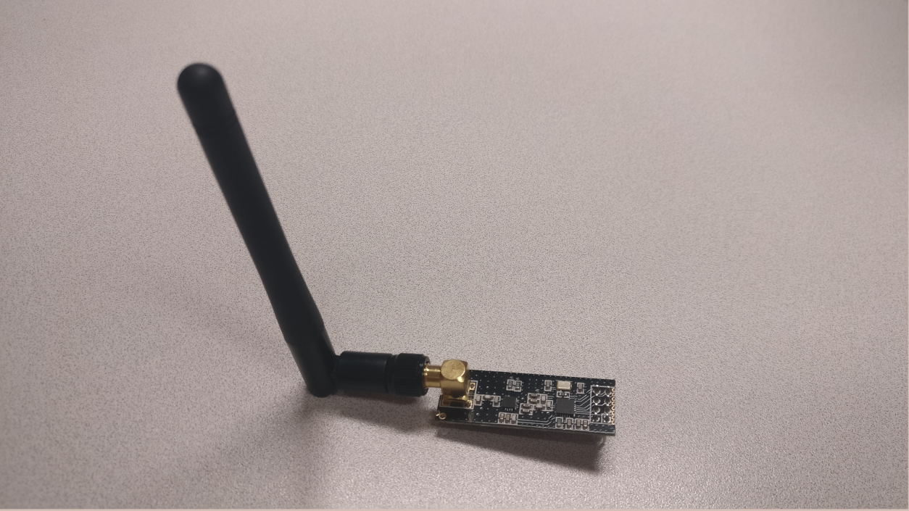
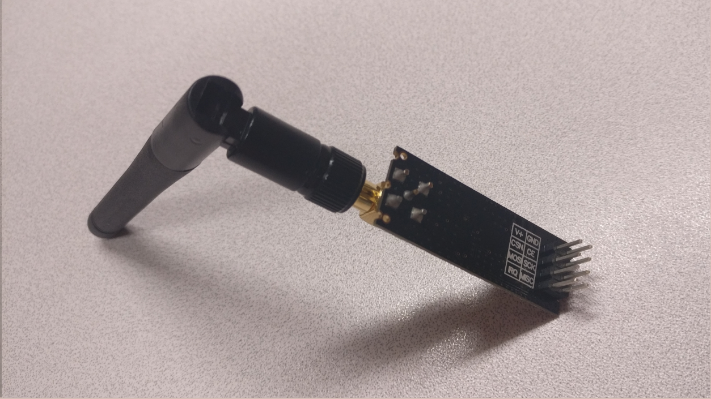
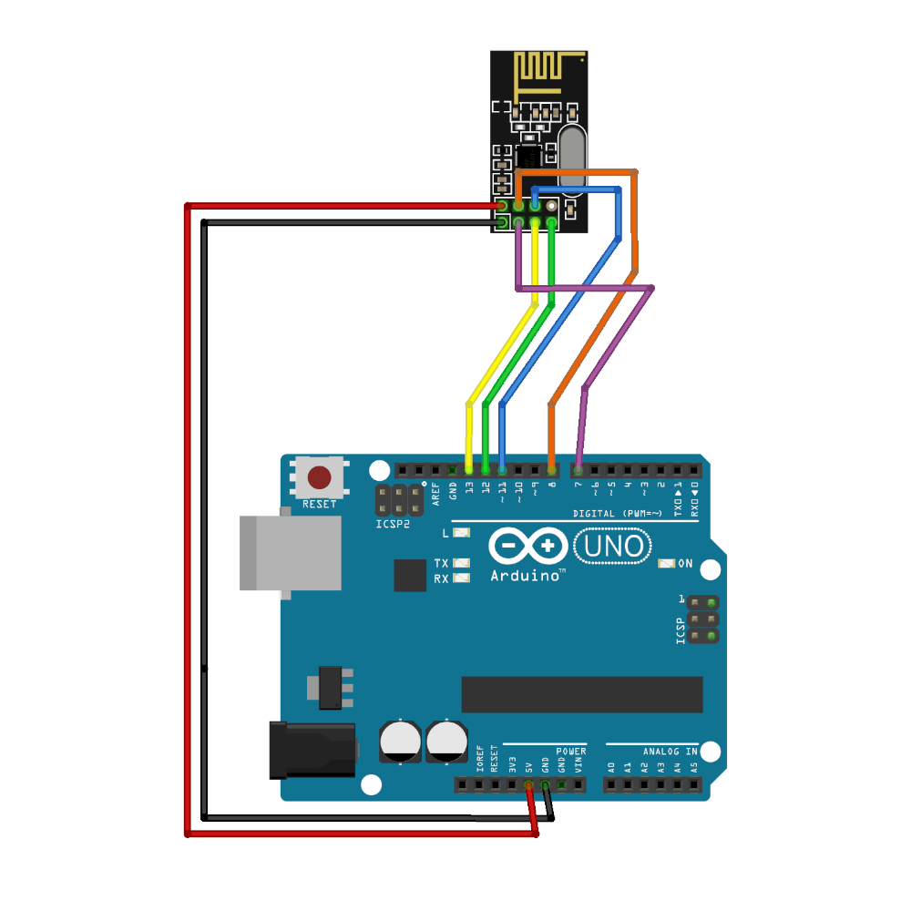
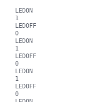

# ADAFRUIT NRF24L01





## Branchements



## Paramétrage :

Ajout de la librairie RF24 dans l'IDE Arduino :
https://github.com/nRF24/RF24/archive/v1.3.1.zip

On peut vérifier les caractéristique des modules avec le programme suivant :

```C
#include <SPI.h>
#include "nRF24L01.h"
#include "RF24.h"
#include "printf.h"

RF24 radio( 7, 8 );

void setup()
{
  Serial.begin( 115200 );
  printf_begin();
  radio.begin();
  radio.printDetails();
}

void loop(){}
```

Qui nous renvoie les informations dans le moniteur série :

```
STATUS		 = 0x0e RX_DR=0 TX_DS=0 MAX_RT=0 RX_P_NO=7 TX_FULL=0
RX_ADDR_P0-1	 = 0x3130303030 0xc2c2c2c2c2
RX_ADDR_P2-5	 = 0xc3 0xc4 0xc5 0xc6
TX_ADDR		 = 0xe7e7e7e7e7
RX_PW_P0-6	 = 0x20 0x00 0x00 0x00 0x00 0x00
EN_AA		 = 0x3f
EN_RXADDR	 = 0x03
RF_CH		 = 0x4c
RF_SETUP	 = 0x01
CONFIG		 = 0x0e
DYNPD/FEATURE	 = 0x00 0x00
Data Rate	 = 1MBPS
Model		 = nRF24L01+
CRC Length	 = 16 bits
PA Power	 = PA_MIN
```

## Test envoi / réception

Code pour l'émetteur :

```C
/*
* Arduino Wireless Communication Tutorial
*     Example 1 - Transmitter Code
*                
* by Dejan Nedelkovski, www.HowToMechatronics.com
*
* Library: TMRh20/RF24, https://github.com/tmrh20/RF24/
*/
#include <SPI.h>
#include <nRF24L01.h>
#include <RF24.h>
RF24 radio(7, 8); // CE, CSN
const byte address[6] = "00001";
void setup() {
  Serial.begin(9600);
  radio.begin();
  radio.openWritingPipe(address);
  radio.setPALevel(RF24_PA_MIN);
  radio.stopListening();
}

char text[10] = "";
int num = 0;

void loop() {
  for (int i=0; i<sizeof(text); i++){
    Serial.print(i);
    Serial.println(text[i]);
  }
  String(num).toCharArray(text,2);
  num = !num;
  radio.write(&text, sizeof(text));
  Serial.println(text);
  delay(1000);
}
```

Code pour le récepteur :

```C
/*
* Arduino Wireless Communication Tutorial
*       Example 1 - Receiver Code
*                
* by Dejan Nedelkovski, www.HowToMechatronics.com
*
* Library: TMRh20/RF24, https://github.com/tmrh20/RF24/
*/
#include <SPI.h>
#include <nRF24L01.h>
#include <RF24.h>
RF24 radio(7, 8); // CE, CSN
const byte address[6] = "00001";
void setup() {
  pinMode(A1, OUTPUT);
  Serial.begin(9600);
  radio.begin();
  radio.openReadingPipe(0, address);
  radio.setPALevel(RF24_PA_MIN);
  radio.startListening();
}
void loop() {
  if (radio.available()) {
    char text[32] = "";
    radio.read(&text, sizeof(text));
    if (text[0] == '1'){
      Serial.println("LEDON");
      digitalWrite(A1, HIGH);
    }
    else {
      Serial.println("LEDOFF");
      digitalWrite(A1, LOW);
    }
    Serial.println(text);
  }
}
```

On récupère bien les informations transmises :


