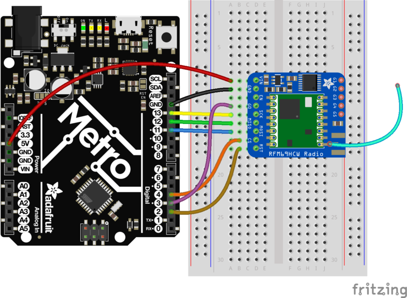

# ADAFRUIT RFM95W
 r


## Branchements



## Paramétrage :

Ajout de la librairie RadioHead dans l'IDE Arduino :
https://github.com/adafruit/RadioHead/archive/master.zip

## Test envoi / réception

En reprenant l'exemple de la librairie précédente (Fichier > Exemples > RadioHead > feather > Feather9x_TX), on modifie simplement les pins correspondant à notre montage dans les #define :

```C++
// Feather9x_TX
// -*- mode: C++ -*-
// Example sketch showing how to create a simple messaging client (transmitter)
// with the RH_RF95 class. RH_RF95 class does not provide for addressing or
// reliability, so you should only use RH_RF95 if you do not need the higher
// level messaging abilities.
// It is designed to work with the other example Feather9x_RX

#include <SPI.h>
#include <RH_RF95.h>

#define RFM95_CS      4
#define RFM95_INT     3
#define RFM95_RST     2
#define LED           13

// Change to 434.0 or other frequency, must match RX's freq!
#define RF95_FREQ 915.0

// Singleton instance of the radio driver
RH_RF95 rf95(RFM95_CS, RFM95_INT);

void setup()
{
  pinMode(RFM95_RST, OUTPUT);
  digitalWrite(RFM95_RST, HIGH);

  Serial.begin(115200);
  while (!Serial) {
    delay(1);
  }

  delay(100);

  Serial.println("Feather LoRa TX Test!");

  // manual reset
  digitalWrite(RFM95_RST, LOW);
  delay(10);
  digitalWrite(RFM95_RST, HIGH);
  delay(10);

  while (!rf95.init()) {
    Serial.println("LoRa radio init failed");
    while (1);
  }
  Serial.println("LoRa radio init OK!");

  // Defaults after init are 434.0MHz, modulation GFSK_Rb250Fd250, +13dbM
  if (!rf95.setFrequency(RF95_FREQ)) {
    Serial.println("setFrequency failed");
    while (1);
  }
  Serial.print("Set Freq to: "); Serial.println(RF95_FREQ);

  // Defaults after init are 434.0MHz, 13dBm, Bw = 125 kHz, Cr = 4/5, Sf = 128chips/symbol, CRC on

  // The default transmitter power is 13dBm, using PA_BOOST.
  // If you are using RFM95/96/97/98 modules which uses the PA_BOOST transmitter pin, then
  // you can set transmitter powers from 5 to 23 dBm:
  rf95.setTxPower(23, false);
}

int16_t packetnum = 0;  // packet counter, we increment per xmission

void loop()
{
  delay(1000); // Wait 1 second between transmits, could also 'sleep' here!
  Serial.println("Transmitting..."); // Send a message to rf95_server

  char radiopacket[20] = "Hello World #      ";
  itoa(packetnum++, radiopacket+13, 10);
  Serial.print("Sending "); Serial.println(radiopacket);
  radiopacket[19] = 0;

  Serial.println("Sending...");
  delay(10);
  rf95.send((uint8_t *)radiopacket, 20);

  Serial.println("Waiting for packet to complete...");
  delay(10);
  rf95.waitPacketSent();
  // Now wait for a reply
  uint8_t buf[RH_RF95_MAX_MESSAGE_LEN];
  uint8_t len = sizeof(buf);

  Serial.println("Waiting for reply...");
  if (rf95.waitAvailableTimeout(1000))
  {
    // Should be a reply message for us now   
    if (rf95.recv(buf, &len))
   {
      Serial.print("Got reply: ");
      Serial.println((char*)buf);
      Serial.print("RSSI: ");
      Serial.println(rf95.lastRssi(), DEC);    
    }
    else
    {
      Serial.println("Receive failed");
    }
  }
  else
  {
    Serial.println("No reply, is there a listener around?");
  }

}
```

Le module tente alors de communiquer en envoyant un message :


En connectant un second module avec le code de l'exemple en réception  (Fichier > Exemples > RadioHead > feather > Feather9x_RX) avec les pins correctement configurés :

```C
// Feather9x_RX
// -*- mode: C++ -*-
// Example sketch showing how to create a simple messaging client (receiver)
// with the RH_RF95 class. RH_RF95 class does not provide for addressing or
// reliability, so you should only use RH_RF95 if you do not need the higher
// level messaging abilities.
// It is designed to work with the other example Feather9x_TX

#include <SPI.h>
#include <RH_RF95.h>

#define RFM95_CS      4
#define RFM95_INT     3
#define RFM95_RST     2
#define LED           13  

// Change to 434.0 or other frequency, must match RX's freq!
#define RF95_FREQ 915.0

// Singleton instance of the radio driver
RH_RF95 rf95(RFM95_CS, RFM95_INT);

// Blinky on receipt
#define LED 13

void setup()
{
  pinMode(LED, OUTPUT);
  pinMode(RFM95_RST, OUTPUT);
  digitalWrite(RFM95_RST, HIGH);

  Serial.begin(115200);
  while (!Serial) {
    delay(1);
  }
  delay(100);

  Serial.println("Feather LoRa RX Test!");

  // manual reset
  digitalWrite(RFM95_RST, LOW);
  delay(10);
  digitalWrite(RFM95_RST, HIGH);
  delay(10);

  while (!rf95.init()) {
    Serial.println("LoRa radio init failed");
    while (1);
  }
  Serial.println("LoRa radio init OK!");

  // Defaults after init are 434.0MHz, modulation GFSK_Rb250Fd250, +13dbM
  if (!rf95.setFrequency(RF95_FREQ)) {
    Serial.println("setFrequency failed");
    while (1);
  }
  Serial.print("Set Freq to: "); Serial.println(RF95_FREQ);

  // Defaults after init are 434.0MHz, 13dBm, Bw = 125 kHz, Cr = 4/5, Sf = 128chips/symbol, CRC on

  // The default transmitter power is 13dBm, using PA_BOOST.
  // If you are using RFM95/96/97/98 modules which uses the PA_BOOST transmitter pin, then
  // you can set transmitter powers from 5 to 23 dBm:
  rf95.setTxPower(23, false);
}

void loop()
{
  if (rf95.available())
  {
    // Should be a message for us now
    uint8_t buf[RH_RF95_MAX_MESSAGE_LEN];
    uint8_t len = sizeof(buf);

    if (rf95.recv(buf, &len))
    {
      digitalWrite(LED, HIGH);
      RH_RF95::printBuffer("Received: ", buf, len);
      Serial.print("Got: ");
      Serial.println((char*)buf);
       Serial.print("RSSI: ");
      Serial.println(rf95.lastRssi(), DEC);

      // Send a reply
      uint8_t data[] = "And hello back to you";
      rf95.send(data, sizeof(data));
      rf95.waitPacketSent();
      Serial.println("Sent a reply");
      digitalWrite(LED, LOW);
    }
    else
    {
      Serial.println("Receive failed");
    }
  }
}
```

On observe bien la communication entre les deux modules :


> /!\ Pour faire clignoter une led avec ce montage, il est necessaire d'utiliser une autre que celle de la carte, étant donné que le pin 13 est déjà utilisé par le module LoRa /!\
