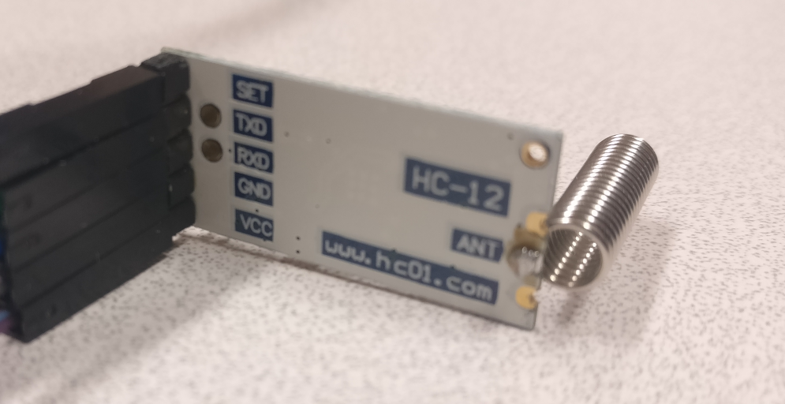
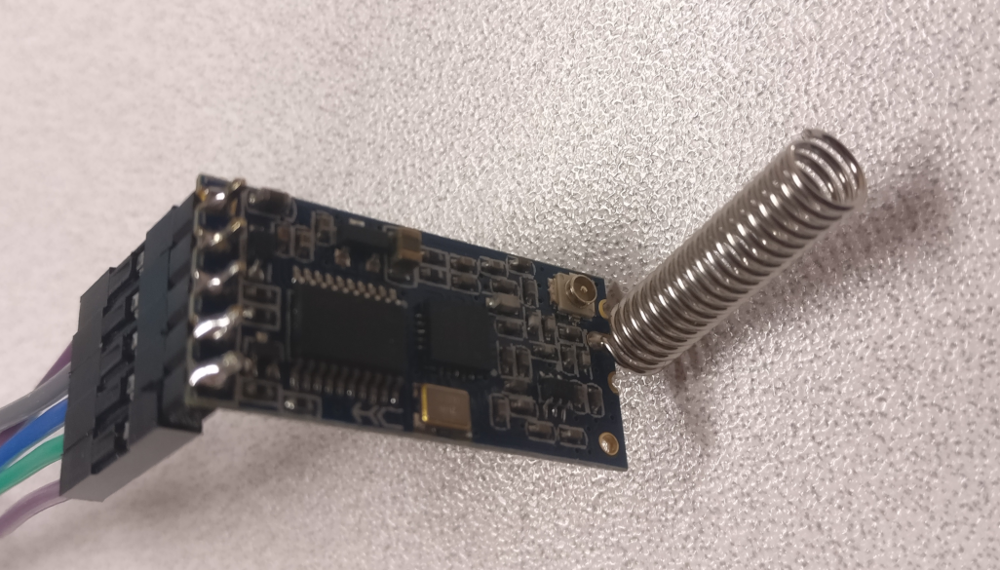

# HC-12





## Branchements :


## Paramétrage :


```C
//HC-12 AT Commander
//Autor Tom Heylen tomtomheylen.com
//The HC-12 commander mode runs at baud rate 9600

#include <SoftwareSerial.h>

SoftwareSerial mySerial(2, 3); // RX, TX

void setup() {
  Serial.begin(9600);
  Serial.println("Enter AT commands:");
  mySerial.begin(9600);
}

void loop(){
  if (mySerial.available()){
    Serial.write(mySerial.read());
  }
  if (Serial.available()){
    mySerial.write(Serial.read());
  }
}
```
Le code précédent permet de lire les paramètres de la carte et de les modifier à l'aide de commandes AT ([Commandes Hayes](https://fr.wikipedia.org/wiki/Commandes_Hayes))

Principales commandes :

|                                   | Commande | Infos |
| --------------------------------- | -------- | --------- |
| Afficher les paramètres           | AT+RX    | Renvoie tout les paramètres de la carte dans le moniteur série |
| Changer le débit                  | AT+Bxxxx | Avec xxxx la valeur du débit (1200bps, 2400bps, 4800bps, 9600bps, 19,200bps, 38,400bps, 57,600bps, ou 115,200bps). La valeur par défaut est 9600bps. |
| Changer le canal                  | AT+Cxxx  | Avec xxx la valeur entre 001 et 127 chaque ajout est un incrément de 400KHz. Par défaut à 001 (433.4MHz), il est recommandé de ne pas dépasser 100. |
| Changer le mode de fonctionnement | AT+FUx   | Avec x entre 1 et 4. Pour établir une communication entre deux modules, il est nécessaire qu'ils soient réglés sur le me mode de transmission et sur le même débit. |

À la commande :
```
AT+RX
```
On a comme réponse :
```
OK+B9600
OK+RC001
OK+RP:+20dBm
OK+FU3
```
On va donc changer le mode de transmission en "FU4" pour obtenir la meilleur postée possible :
```
AT+FU4
```
Notre réponse :
```
OK+FU4,B1200
```
Vérification de la prise en compte des modifications :
```
AT+RX
```
Le débit et le mode de transmission ont bien été modifiés (à effectuer sur tous les modules pour assurer leur compatibilité) :
```
OK+B1200
OK+RC001
OK+RP:+20dBm
OK+FU4
```
## Test envoi / réception

Le programme suivant :
```C
//HC-12 messenger send/receive
//autor Tom Heylen tomtomheylen.com

#include <SoftwareSerial.h>

SoftwareSerial mySerial(2, 3); //RX, TX

void setup() {
  Serial.begin(1200);
  mySerial.begin(1200);
}

void loop() {


  if(Serial.available() > 0){//Read from serial monitor and send over HC-12
    String input = Serial.readString();
    mySerial.println(input);    
  }

  if(mySerial.available() > 1){//Read from HC-12 and send to serial monitor
    String input = mySerial.readString();
    Serial.println(input);    
  }
  delay(20);
}
```
permet de tester la bonne communication entre deux modules sans fil. En connectant deux Arduino équipés chacune d'un module à un ordinateur, on peut, par l'intermédiaire des moniteurs série de deux instances de l'IDE Arduino, envoyer des informations de l'un à l'autre et inversement.
