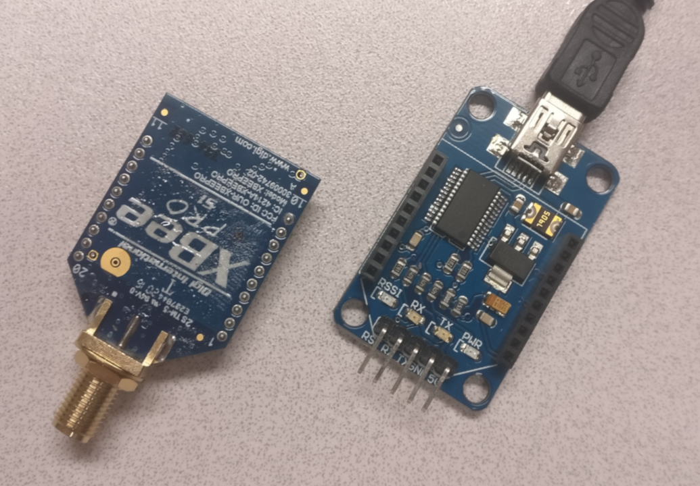
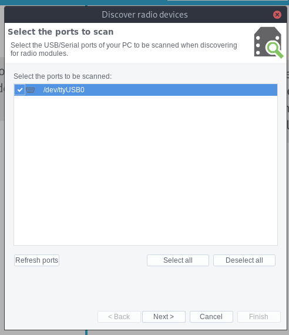
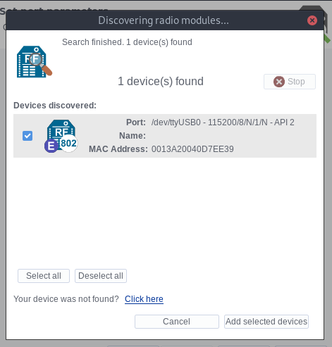
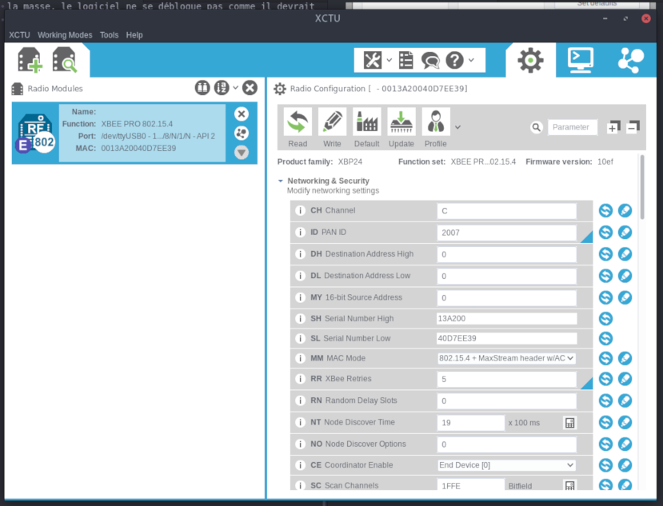

# XBee


## Paramétrage :

Les modules xBee sont différents des autres modules utilisées jusqu'à présent, ils possèdent en effet une mémoire et un firmware spécifique, avec des adresses.

Pour la configuration de ces modules, il est nécessaire d'utiliser le logiciel XCTU, fourni par DIGI (producteur des modules xBee)

Le logiciel est disponible [ici](https://www.digi.com/support/productdetail?pid=3352) dans la section ***Diagnostics,Utilities and MIBs***

* XCTU version 6.4.0 (dernière version en date)
* Legacy XCTU, version 5.2.8.6 (génération précédente)

## Problèmes rencontrés :

La plupart des tutoriels utilisent un [USB explorer ](https://www.sparkfun.com/products/11812) pour connecter le xBee à l'ordinateur. Ne possédans pas cet appareil, j'ai donc utilisé une carte arduino ([UNO](https://www.sparkfun.com/products/11021) et [MEGA](https://www.sparkfun.com/products/11061)) associé à un [shield xbee](https://www.gotronic.fr/art-module-xbee-shield-12427.htm).

J'ai donc commencé mes tests avec XCTU V6.4.0 et le module xBee connecté au shield sur l'Arduino MEGA.

La découverte des modules connecté au pc est possible avec le second bouton en haut à gauche de l'écran :


Une popup s'ouvre alors en listant les ports COM disponibles, on selectionne celui correspondant à l'Arduino avant de cliquer sur *Next* :


S'ouvrent alors les paramètres de recherche des modules, et on peut cliquer sur *Finish* pour lancer la recherche :


Le module devrait alors apparaître sur le côté gauche de l'écran :


*** Premier problème : ***

À ce moment, la carte Arduino et le module associé sont donc reconnus par le logiciel, mais les paramètres internes ne le sont pas encore, on sélectionne donc l'option *Read* :


Une pop up s'affiche alors en demandant de reset notre module radio :


Cependant, ni le bouton reset ni le bouton présent sur le shield ne permettent de débloquer cet écran.

Après avoir suivi [ce tuto](https://learn.sparkfun.com/tutorials/exploring-xbees-and-xctu/troubleshooting#reset) pour reset un module xBee en connectant le pin 5 (reset) au pin 10 (GND). La LED présente sur le shield s'éteint puis se rallume, indiquant le reset du module, mais la popup reste cependant, jusqu'à se transformer en message d'erreur au bout d'un certain temps.

Apres recherche, il s'avère que les versions précédentes du logiciel ne nécessitent pas cette action, j'ai donc tenté de l'utiliser avec l'aide de [ce tuto](https://robotic-controls.com/book/export/html/14) d'utiliser la version "legacy" de xctu.

La carte Arduino sans son microcontrolleur a donc été couplé au shield dont les jumpers sont passés en mode *USB* :


Sur le logiciel, la carte Arduino est bien reconnue par le logiciel:


Après avoir cliqué sur le bouton *Test / Query*  le logiciel reconnaît bien la carte et le module xBee.

Je débranche donc le montage pour le réutiliser avec le logiciel récent.

*** Deuxième problème ***

Sur le "nouveau" xctu, à la fin de la recherche de module xBee, après avoir correctement sélectionné le bon port, aucun module xBee n'est trouvé, ou bien une erreur apparaît indiquant un timeout sans que le logiciel n'ait pu récupérer les informations de la carte :


De retour sur la version Legacy de xctu, le logiciel nous demande maintenant de reset le module xBee. Comme relevé dans le premier problème, même en connectant le pin RST à la masse, le logiciel ne se débloque pas comme il devrait :


Au final, avec la carte Arduino MEGA, ou avec la carte Arduino UNO, avec ou sans microcontrôleur, avec les jumpers en mode USB ou xBee, et sur les deux logiciels, le résultat est le même : aucune connexion n'est possible entre le logiciel et le module xBee.
J'ai également essayé avec un troisième module xBee, qui ne m'avait pas encore servi, et le résultat est resté le même.  

## xBee USB Adapter



Unne fois le module xBee installé sur la carte, et la carte connectée au pc, on peux lancer une découverte depuis XCTU :


Un appareil USB devrait alors être reconnu :



On laisse les paramètres de découverte par défaut avant de cliquer sur le bouton *Finish* :


On ajoute ensuite le module trouvé par XCTU *Add selected devices* :



En cliquant sur le module à gauche de l'écran, une lecture des paramètres se lance automatiquement (elle peut être forcée à l'aide du bouton *Read* ) :


La partie droite de l'écran présenta alors les différents paramètres du module qu'il est possible d'éditer :



Il est possible de sauvegarder ou de charger les paramètres du xBee à partir du menu "Profile"


J'ai réinitialisé les modules à leur configuration d'usine à l'aide du bouton Default


Pour établir une connexion entre deux modules xBee, ils doivent avoir le même canal (**CH** Channel) et la même adresse pan (Personal Area Network) (**ID** PAN ID).

Il est possible de conserver des adresses (**MY** 16-bit Source Adress) identique pour les deux modules, la transmission s'effectuera alors en broadcast.

Il est également possible de paramétrer des adresses spécifiques pour envoyer le message à un destinataire précis.
Pour cela, il faut faire correspondre les numéros de série haut et bas du destinataire (**SH** Serial Number High et **SL** Serial Number Low) avec les adresse de destination de l'expéditeur (**DH** Destination adress High et **DL** Destination Adress Low).

## Test envoi / réception

L'envoi s'effectue avec une connexion série :

Code pour l'émetteur :

```C
int timer = 0;

void setup()
{
Serial.begin (9600);
}

void loop()
{
Serial.println("Message : "+String(timer)+" Sec.");
timer++;
delay(1000); // Attendre 1s
}
```

Code pour le Récepteur :

```C
int incomingByte = 0;   

void setup() {
        Serial.begin(9600);
}

void loop() {

        if (Serial.available() > 0) {
                incomingByte = Serial.read();
                Serial.print(char(incomingByte));
        }
}
```
